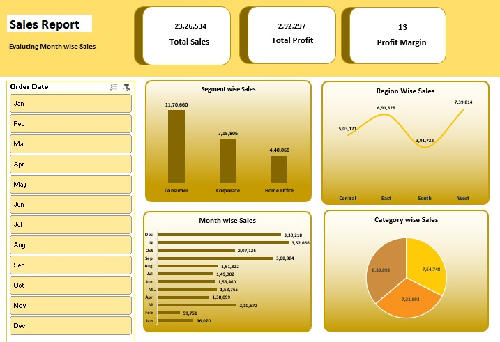

# 📊 Sales Report Dashboard (Excel)

An interactive Sales Dashboard built in Microsoft Excel to analyze month-wise, region-wise, segment-wise, and category-wise sales performance.
This dashboard provides key business insights including Total Sales, Total Profit, and Profit Margin using dynamic visuals and filters.

---

## 📌 Project Overview

This project analyzes sales data and presents meaningful insights using:

- 📅 Month-wise Sales Analysis
- 🌍 Region-wise Sales Comparison
- 🏢 Segment-wise Sales Distribution
- 📦 Category-wise Sales Breakdown
- 💰 KPI Metrics (Total Sales, Total Profit, Profit Margin)

The dashboard allows users to filter data by month to dynamically update reports.

---

## 🛠️ Tools & Technologies Used

- Microsoft Excel
- Pivot Tables
- Pivot Charts
- Slicers (Month Filter)
- Data Cleaning & Formatting
- KPI Cards Design
- Data Visualization Techniques

---

## 📊 Key Metrics Displayed

- **Total Sales:** 23,26,534
- **Total Profit:** 2,92,297
- **Profit Margin:** 13%

---

## 📈 Dashboard Insights

### 🔹 Segment Wise Sales
- Consumer segment contributes the highest sales.
- Corporate and Home Office segments follow.

### 🔹 Region Wise Sales
- West region shows the highest sales.
- South region shows comparatively lower performance.

### 🔹 Month Wise Sales
- Highest sales observed in December.
- Consistent growth trend in Q4.

### 🔹 Category Wise Sales
- Category distribution shown using Pie Chart.
- Clear visualization of contribution percentage.

---

## 🎯 Features

- Interactive month filter
- Clean and professional dashboard layout
- KPI summary cards
- Data-driven insights
- Business-friendly visualization

---

## Dashboard Preview

## 🚀 How to Use

1. Open the Excel file.
2. Use the Month filter (left panel).
3. Dashboard automatically updates charts and KPIs.
4. Analyze trends and performance metrics.

## 👨‍💻 Author

Pravin Bankar
